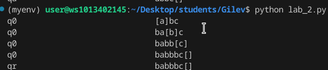

# Лабораторная работа No2. Машина Тьюринга
## Задание: A={a,b,c}. Приписать слева к слову P символ b (P -> bP)
### Код: 
```python
from turing_machine import TuringMachine 
add_one =TuringMachine(
    {
        ('q0','a'): ('q0','ba','R'),
        ('q0','b'): ('q0','bb','R'),
        ('q0','c'): ('q0','bc','R'),
    }
)
add_one.debug('abc')
```
### Вывод: 