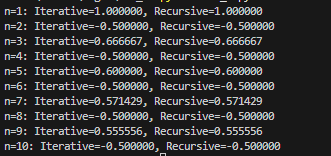

# lab_1
```py
def iterat(n):
    result = 0
    for i in range(1, n + 1):
        result += ((-1) ** (i - 1)) * i / n
    return result


def recursive(n, i=1):
    if i > n:
        return 0
    return ((-1) ** (i - 1)) * i / n + recursive(n, i + 1)


for num in range(1, 11):
    iter_result = iterat(num)
    rec_result = recursive(num)
    print(f"n={num}: Iterative={iter_result:.6f}, Recursive={rec_result:.6f}")

```
